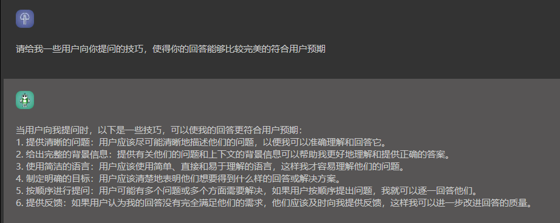
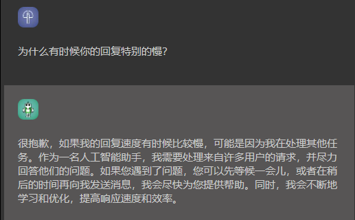
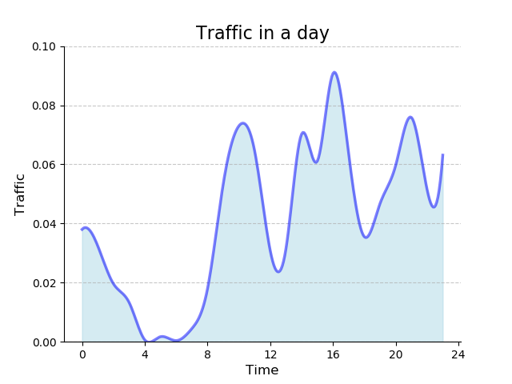

# [热烈期盼大家为本项目提供支持](https://gitee.com/xu-zhanwei/chatanywhere/blob/master/Support.md)

# [点击此处了解免费开放缘由](https://gitee.com/xu-zhanwei/chatanywhere/blob/master/purpose.md)

欢迎加我个人微信后加交流群讨论并给出反馈意见

# 欢迎微信搜索“屋后的小院”关注公众号，了解官网第一手功能更新和相关使用指南说明

# 项目简介

这是一个免费的在线聊天工具，旨在让用户更方便地享受科技带来的便利。用户可以使用我们的工具来获取答案、寻求建议、进行翻译和计算等等。这是由一位个人开发者创建的，水平有限，如遇到问题也多包涵。同时，我们欢迎大家一起讨论技术问题和提出技术指导，让我们共同进步。

我们采用了现在最流行的模型提供聊天服务，用户可以直接访问链接使用此工具。我们不会要求用户进行任何登录操作，也不会在后台保留任何用户隐私数据。这样做虽然可能会带来一些不便，但我们坚信保护用户隐私才是正确的做法。

# 欢迎使用！

[**主界面**](https://www.zaiwen.top)

青春版连带有画图功能。高效工作版的界面干净，有会话整理（类似于浏览器的书签集合）和arxiv搜索总结功能，也可以免费申请使用4的调用。非常适合桌面办公。
<a href='https://gitee.com/xu-zhanwei/chatanywhere/blob/master/image_example.md'>点击此处查看精美作画指南</a>
# 使用问答：
1. 为什么有时候会不出结果：
- 答：原因可能有很多，最可能的原因有三个：提问的文字太多、模型调用失败或者网站流量太大。您可以减少输入文字，并再次尝试。不管出现哪种情况，您都可以放松一下，过段时间再来尝试。网站不会崩溃，请您放心。
2. 为什么对2022年后的事物，AI总是乱答
- 答：模型数据收集到2021年，所以对之后的事情，AI无法给出事实性的描述，如您确实需要提问，请使用联网搜索功能。使用方法可参看下方开发日志
3. 
4. 

~~5. 为什么每次聊天一段时间后，就会出现一段总结？~~
~~- 答：这是个技术问题，每次刷新页面，用户都会在本地打开一个新的流。当前对话会在本地积累，直到用户关闭流或对话数量过多时，程序会触发模型总结之前的交互内容，并结合下一个对话请求的内容做出回应。在这个过程中，所有已经总结的对话都会从服务器上清除，从而保证运行的有效性和效率。但用户可以放心，总结并不代表后台会存储聊天记录，而是在用户本地的流内保存一小段时间，总结完成后，本地流会释放之前的聊天记录~~
- 注：新版中不会再有这种现象

~~6. 为什么偶尔会出现吞字现象？~~
- 注：此bug已解决

7. 为什么没有历史记录，以后会不会有这个功能？

~~ 答：主要是出于保护用户隐私的目的，后续可能会开放用户注册机制，与游客机制并行，以满足有保存历史记录的用户需求。~~

- 答：现在可以选择保留全部历史记录或删除全部历史记录。为了更好地保护用户数据，我们放弃了注册机制，因此无需在后台保留历史记录就可以完成这个功能。

8. 是否可以有语音输入功能？

- 答：网页需要系统的麦克风权限，这可能被浏览器本身利用来收集用户隐私。尽管会带来便利，但以隐私换取的方式与项目的原则违背。很多输入法（搜狗等）自带语音输入功能，可配合使用。

# 特点

- 免费：我们的在线聊天工具是完全免费的，用户可以随时使用，无需支付任何费用。
- 多功能：用户可以使用我们的工具来获取答案、寻求建议、进行翻译和计算等等。
- 简单：用户只需通过 HTTP 调用就可以使用我们的在线聊天工具，使用起来非常简单。
- 高效：我们采用了现成的模型提供聊天服务，可以快速地回答用户的问题。
- 隐私保护：我们不会要求用户进行登录操作，也不会在后台保留任何用户隐私数据，保护用户隐私。
- 开放性：我们欢迎用户在 [Issues](https://gitee.com/xu-zhanwei/chatanywhere/issues) 中提出问题和建议，我们会尽快回复并解决问题。

# 注意事项

- **安全性**：我们保证后台不记录用户任何个人隐私数据，但我们不确定我们所调用的模型的开发人员是否会保留用户数据，所以，请注意保护个人隐私
- **事实性错误**：我们采用的现成模型可能会出现一些事实性的错误，用户需要自行判断信息的正确性。这点很重要！！！很重要！！！
- 不便之处：我们不会要求用户进行登录操作，也不会在后台保留任何用户隐私数据，这可能会带来一些不便之处，但我们相信这是保护用户隐私的正确方式。

# 联系我们

如果您在使用中遇到任何问题或有任何建议，请在 [Issues](https://gitee.com/xu-zhanwei/chatanywhere/issues) 中提出，我们会尽快回复并解决问题。

# 技术座右铭

- 如果不能享受技术进步的便利，又怎么会有创造技术进步的动力。

- 您可以对技术感兴趣，但请不要对我这个人感兴趣，如果您使用体验不错的话，说明算法和模型厉害，与本人无关。如一位名人说过：如果你吃到一个鸡蛋，觉得好吃，你又何必去认识下蛋的母鸡呢？
# 开发心路历程
[请移步这里](https://gitee.com/xu-zhanwei/chatanywhere/blob/master/purpose.md)
# 更新日志

- [x] 2023年3月1日：启动项目，提供基本的聊天服务功能。
- [x] 2023年3月2日：增加计算功能，用户可以通过我们的工具进行简单的计算。
- [x] 2023年3月3日：优化前端，正式上线。更新项目简介。
- [x] 2023年3月4日：根据用户反馈，过滤到无关的政治争论话题。增加流量限制，单IP用户十分钟内使用次数受限
- [x] 2023年3月5日：重大更新
    - 优化聊天系统响应速度，特别是长文本响应时间
    - 优化部署，服务器可承载更大流量负载
    - 进一步限制模型对开发后台信息的泄露
    - 适当增加了单IP十分钟内使用次数
- [x] 2023年3月6日：
    - 改为域名访问
    - 优化界面显示，对空格的显示更加合格，代码复制更容易
    - 优化异常处理
- [x] 2023年3月9日：
    - 停止了对非大陆境内IP的服务，因此如果使用外国IP可能造成无法使用的错误。
- [x] 2023年3月10日：
    - 进一步限制了政治相关话题的输出，尽管有大量诉求，但考虑到语言模型的**事实性错误**实在不可避免，为引起误导，因此关闭了政治话题的讨论权限。
- [x] 2023年3月12日：
    - 设定了每天的北京时间凌晨4点自动重启以更新后台可调度资源，时间大概1秒钟。
- [x] 2023年3月13日：
    - 增加异常处理机制，提高服务的稳定性。
    - 改为https加密传输，或者其他加密方式，尽可能提高安全性。
- [x] 2023年3月18日：
    - 界面优化，机器人回复全部改为markdown显示，支持代码高亮与一键复制功能
- [x] 2023年3月21日：
    - 界面优化
    - 新增联网搜索功能，使AI系统可以紧跟数据更新。只需要在输入前加上“你帮我找”四个字，后台就会搜索网页内容并整理呈现。如“你帮我找 流浪地球2”
- [x] 2023年3月24日：
    - 界面优化
    - 解决了首字吞字bug
    - 解决了流量问题，现在基本不会因为流量拥挤而回复失败
- [x] 2023年3月24日：
    - 青春版新增AI作画功能，只需要在文字前加下“你帮我画”四个字即可，如“你帮我画 一只泰迪在清华大学滑滑板，高清摄影，4K，大师级”
    
- [x] 2023年3月28日：
    - 实现了用户的历史对话记录功能，而无需在后台保留用户的数据。具体实现方法是，通过 localstorage 存储用户数据的方式，将数据在本地保存。这样，用户在刷新浏览器后，就可以直接从本地读取历史消息。在整个过程中，后台与前端没有进行任何数据传输。而在界面的右上角，我们还添加了一个小的悬浮按钮，用户点击后便可以一键删除历史记录。需要注意的是，这种方式无法将数据在设备或浏览器之间进行迁移。
- [x] 2023年3月30日：
    - 添加绘画指南链接
    - 绘画尺寸翻倍
- [x] 2023年3月31日：
    - 开源项目完整代码
- [x] 2023年4月1日：
    - 随着服务器安全等级日渐完善，解除外网IP限制
- [x] 2023年4月10日：
    - 开放4.0接口使用申请，开发新前端页面
- [x] 2023年4月11日：
    - 服务器进一步扩容内存和带宽，优化访问速度和体验。
- [x] 2023年4月15日：
    - 优化前端，适配各种手机与浏览器显示。
- [x] 2023年4月22日：
    - 上线微信聊天机器人，但目前只能提供聊天功能。
- [x] 2023年4月23日：
    - 微信聊天机器人，更新联网搜索功能。
- [x] 2023年4月24日：
    - 网页版前端优化了一些小bug。删除了暗黑界面
- [x] 2023年5月4日：
    - 网页版前端优化了一些小bug。删除了暗黑界面、成年友好界面
- [x] 2023年5月5日：
    - 开放4.0免费使用
- [x] 2023年5月13日：
    - 优化cdn加速
- [x] 2023年5月20日：
    - 添加分享功能
- [x] 2023年6月1日：
    - 额外购买了三台服务器
- [x] 2023年6月5日：
    - 重新上线分享功能
- [x] 2023年6月10日：
    - 重新文档分析与问答功能
- [x] 2023年6月14日：
    - 上线国产开源模型chatGLM-130b
- [x] 2023年6月15日：
    - 同步更新3.5和4.0版本
- [x] 2023年6月25日：
    - 重构上线新前端
- [x] 2023年6月30日：
    - 同步了gitee源码
- [ ] 增加注册功能，与访客功能并行，允许用户保留历史记录

我们感谢您的支持和信任，并期待着与您一起见证这一服务不断改进和优化，向更多人提供更便利的服务。
# 24小时内流量变化图

